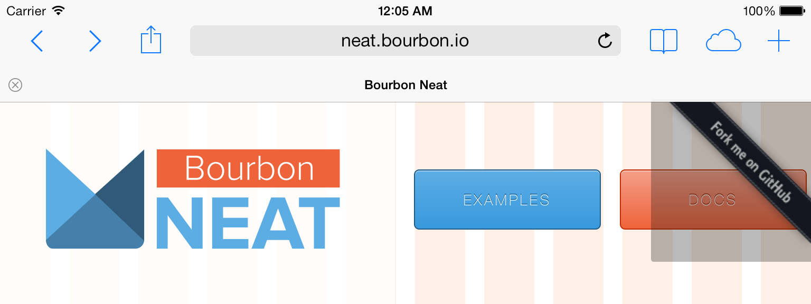
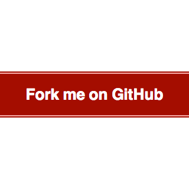

+++
title = "GitHub Ribbon Using CSS Transforms"
date = "2014-01-12"
tags = ["CSS", "GitHub"]
+++

Do you know when [Tom Preston-Werner](https://twitter.com/mojombo) released the ['Fork me on GitHub' ribbons](http://github.com/blog/273-github-ribbons) that you often see on websites for open-source projects? It was _December 2008_! Man I feel old...

I like the idea behind the ribbon. It's an easy way of telling your users that this software is open-source, and that there's a repo available for them to browse and fork. Using an image for the ribbon though? I don't like that at all, for multiple reasons:

- Changing things like the font or the colors of the ribbon is really inconvenient, as it forces you to fire up an image editor.
- Including this image on your page means an additional request, and about 8KB of payload.
- You have to be careful with the positioning of the image, as it's a pretty big square, and you don't want it to block part of your site's navigation.
- You have to think about generating and serving a high-definition version if you don't want your ribbon to look all pixelated on HiDPI devices.

<!--more-->

The site for [Thoughtbot's Neat project](http://neat.bourbon.io/) showcases the last two problems perfectly:



Yeah, it looks really bad on a HiDPI screen. But most important, with certain viewport widths, the ribbon overlaps one of the main navigation buttons in the page, making it quite difficult to press. This could be ammeliorated with [image maps](https://developer.mozilla.org/docs/Web/HTML/Element/map), so that only the actual ribbon is clickable, but I think we can do better...

What if I told you we can replicate the ribbon in pure HTML and CSS? Easy styling! No extra requests! Reasonably sized clickable areas! No _@2x_ images! I would sound like a late-night infomercial, wouldn't I? But it's all true, check out the [demo](demo.html).

## Step by step

First of all, let's deal with the HTML. We just need an extra `div` tag surrounding the link to our GitHub page:

```html
<div class="ribbon">
  <a href="#">Fork me on GitHub</a>
</div>
```

Now let's try to replicate the look of the ribbon with some basic CSS:

```css
.ribbon {
  background-color: #a00;
  overflow: hidden;
  white-space: nowrap;
}
.ribbon a {
  border: 1px solid #faa;
  color: #fff;
  display: block;
  font: bold 81.25% "Helvetica Neue", Helvetica, Arial, sans-serif;
  margin: 1px 0;
  padding: 10px 50px;
  text-align: center;
  text-decoration: none;
}
```

The only rules that may catch your eye are those `overflow: hidden` and `white-space: nowrap`. They are there just to avoid the text spanning two lines.

Also, the typeface used for the original GitHub ribbon is [Collegiate](http://www.fontriver.com/font/collegiate/). I went with Helvetica instead, but feel free to experiment with [`@font-face`](https://developer.mozilla.org/docs/Web/CSS/@font-face) if you want to stay faithful to the original design.

Here is what we've got:



To achieve the rotation effect, we'll use the `transform` property. It's still being [standardized](http://www.w3.org/TR/css3-transforms/), so we'll have to fall back to browser-specific declarations (`-webkit-transform` for Safari 3.1+, `-moz-transform` for Firefox 3.5+, etc.):

```css
.ribbon {
  /* ... */
  position: absolute;
  left: -50px;
  top: 40px;
  -webkit-transform: rotate(-45deg);
     -moz-transform: rotate(-45deg);
      -ms-transform: rotate(-45deg);
       -o-transform: rotate(-45deg);
          transform: rotate(-45deg);
  /* ... */
}
```

We are applying a counterclockwise rotation of 45 degrees, and using the `top` and `left` properties to place the ribbon in the upper left corner of the page.

We should be looking at something similar to this:


Let's give the ribbon its final touches by using the `text-shadow` and `box-shadow` properties. The latter is also being [standardized](http://www.w3.org/TR/css3-background/), so again we have to fall back to browser-specific declarations (`-webkit-box-shadow` for Safari 3.0+, `-moz-box-shadow` for Firefox 3.5+, etc.):

```css
.ribbon {
  /* ... */
  -webkit-box-shadow: 0 0 10px #888;
     -moz-box-shadow: 0 0 10px #888;
          box-shadow: 0 0 10px #888;
  /* ... */
}
.ribbon a {
  /* ... */
  text-shadow: 0 0 5px #444;
}
```

If you take a look at the documentation for those two properties, you'll see we're using shadows with no offset and a slight blur.

The result:


It's not identical to the original, but I think it's a good enough approximation.

## Summing up

This is all the CSS we used to build the ribbon:

```css
.ribbon {
  background-color: #a00;
  overflow: hidden;
  white-space: nowrap;
  /* top left corner */
  position: absolute;
  left: -50px;
  top: 40px;
  /* 45 deg ccw rotation */
  -webkit-transform: rotate(-45deg);
     -moz-transform: rotate(-45deg);
      -ms-transform: rotate(-45deg);
       -o-transform: rotate(-45deg);
          transform: rotate(-45deg);
  /* shadow */
  -webkit-box-shadow: 0 0 10px #888;
     -moz-box-shadow: 0 0 10px #888;
          box-shadow: 0 0 10px #888;
}
.ribbon a {
  border: 1px solid #faa;
  color: #fff;
  display: block;
  font: bold 81.25% "Helvetica Neue", Helvetica, Arial, sans-serif;
  margin: 1px 0;
  padding: 10px 50px;
  text-align: center;
  text-decoration: none;
  /* shadow */
  text-shadow: 0 0 5px #444;
}
```

It's practically begging to be turned into a [Sass](https://sass-lang.com/) mixin, so that you can pass the color of the ribbon as a parameter, and maybe its position too... But I'll leave that as an exercise to you, dear reader.

## Browser support

You saw this one coming, didn't you? Some of those awesome properties we were using are only available on modern browsers:

<div class="table-wrapper">
  <table>
    <thead>
      <tr>
        <th class="text-end">&nbsp;</th>
        <th>Chrome</th>
        <th>Firefox</th>
        <th>IE</th>
        <th>Opera</th>
        <th>Safari</th>
      </tr>
    </thead>
    <tbody>
      <tr>
        <td class="text-end">-webkit-transform</td>
        <td>4.0+</td>
        <td>No</td>
        <td>No</td>
        <td>15.0+</td>
        <td>3.1+</td>
      </tr>
      <tr>
        <td class="text-end">-moz-transform</td>
        <td>No</td>
        <td>3.5+</td>
        <td>No</td>
        <td>No</td>
        <td>No</td>
      </tr>
      <tr>
        <td class="text-end">-ms-transform</td>
        <td>No</td>
        <td>No</td>
        <td>9.0+</td>
        <td>No</td>
        <td>No</td>
      </tr>
      <tr>
        <td class="text-end">-o-transform</td>
        <td>No</td>
        <td>No</td>
        <td>No</td>
        <td>10.5+</td>
        <td>No</td>
      </tr>
      <tr>
        <td class="text-end">transform</td>
        <td>No</td>
        <td>16.0+</td>
        <td>10.0+</td>
        <td>No</td>
        <td>No</td>
      </tr>
      <tr>
        <td class="text-end">-webkit-box-shadow</td>
        <td>4.0+</td>
        <td>No</td>
        <td>No</td>
        <td>No</td>
        <td>3.1+</td>
      </tr>
      <tr>
        <td class="text-end">-moz-box-shadow</td>
        <td>No</td>
        <td>3.5+</td>
        <td>No</td>
        <td>No</td>
        <td>No</td>
      </tr>
      <tr>
        <td class="text-end">-ms-box-shadow</td>
        <td>No</td>
        <td>No</td>
        <td>No</td>
        <td>No</td>
        <td>No</td>
      </tr>
      <tr>
        <td class="text-end">-o-box-shadow</td>
        <td>No</td>
        <td>No</td>
        <td>No</td>
        <td>No</td>
        <td>No</td>
      </tr>
      <tr>
        <td class="text-end">box-shadow</td>
        <td>10.0+</td>
        <td>4.0+</td>
        <td>9.0+</td>
        <td>10.5+</td>
        <td>5.1+</td>
      </tr>
      <tr>
        <td class="text-end">text-shadow</td>
        <td>4.0+</td>
        <td>3.5+</td>
        <td>10.0+</td>
        <td>9.5+</td>
        <td>3.1+</td>
      </tr>
    </tbody>
    <tfoot>
      <tr>
        <td class="text-end">&nbsp;</td>
        <td>4.0+</td>
        <td>3.5+</td>
        <td>10.0+</td>
        <td>10.5+</td>
        <td>3.1+</td>
      </tr>
    </tfoot>
  </table>
</div>

If you don't give a flying fairy about old versions of Internet Explorer, then go for it! Forget about images, and bask in the delights of pure HTML and CSS!
