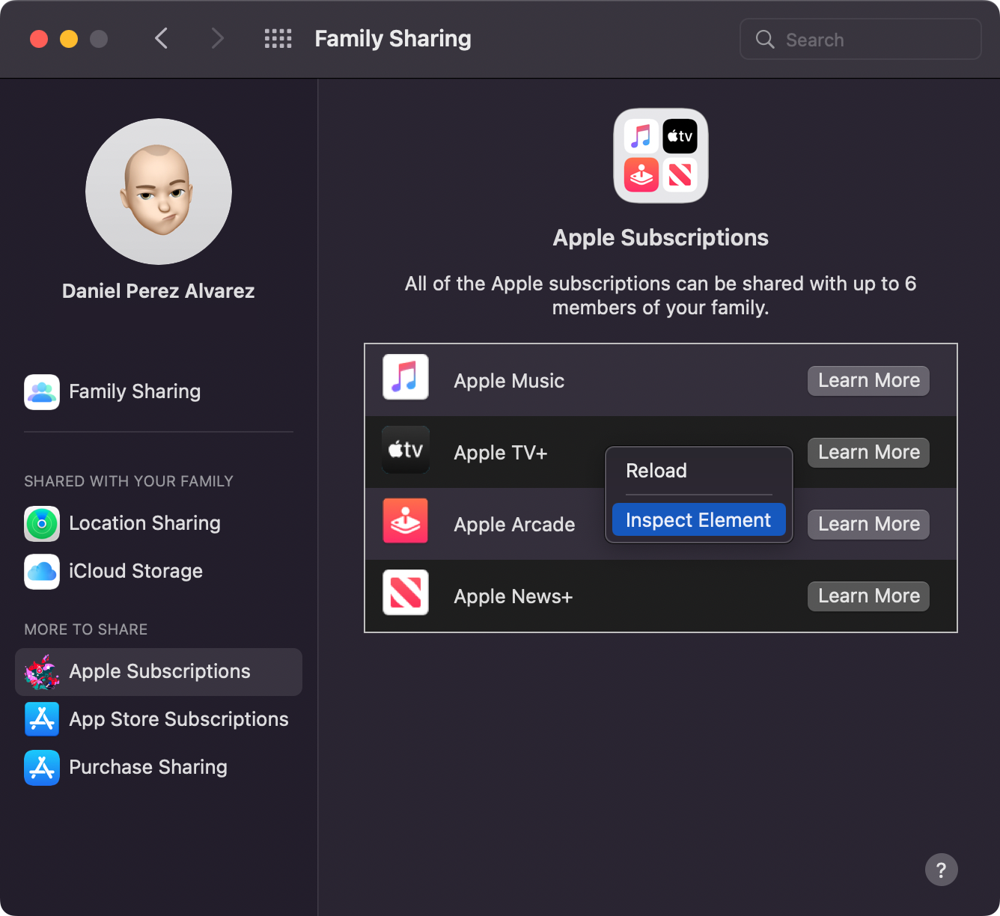
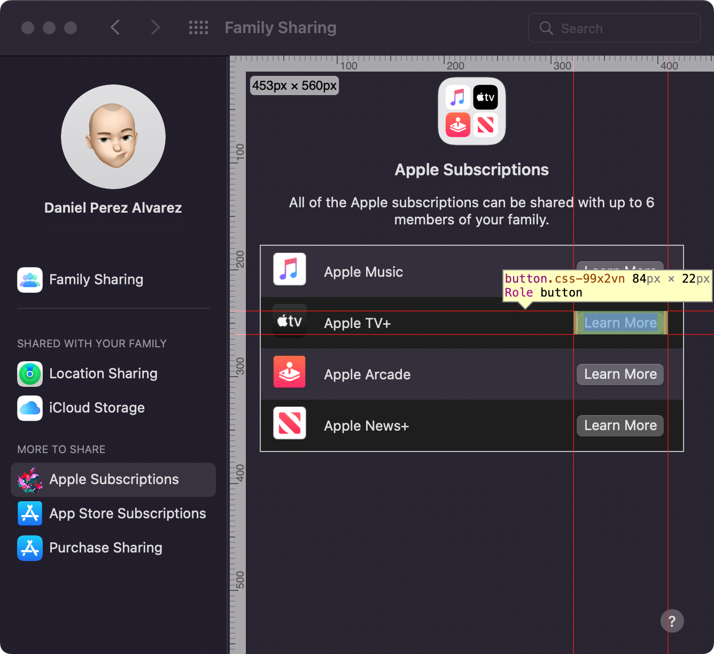
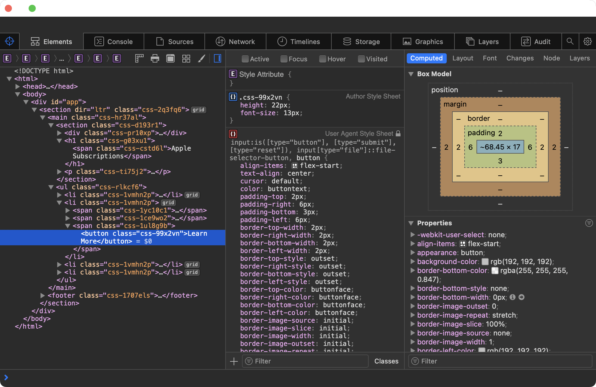

+++
title = "Inspect WebViews in Any macOS App"
date = "2022-04-04"
tags = ["macOS"]
+++

Did you know you can inspect any WebView on any macOS app, just by right-clicking it?
{.lead}

<!--more-->

The only thing you need to do is change your user defaults by running the following command:

```
defaults write -g WebKitDeveloperExtras -bool true
```

Once you do that, you should be able to right-click inside any WebView, and you'll get a context menu like this one:



If you select _Inspect Element_, you get a full Web Inspector, just like you would in Safari.



I love peeking behind the curtain. Look, [system colors](https://drafts.csswg.org/css-color/#css-system-colors) in the wild!


