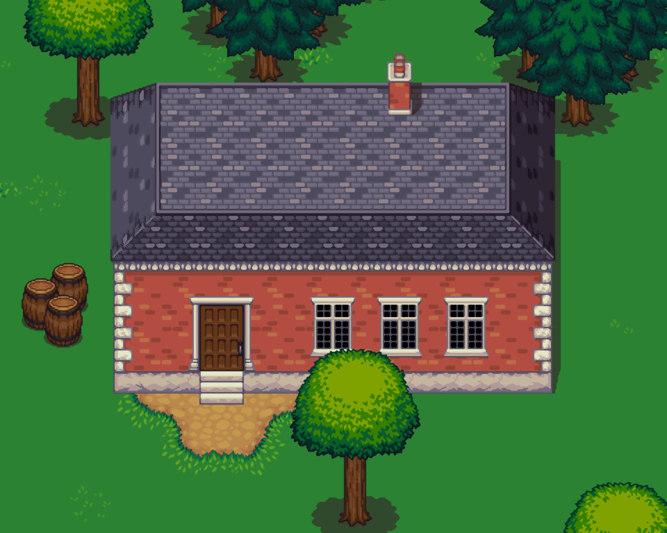
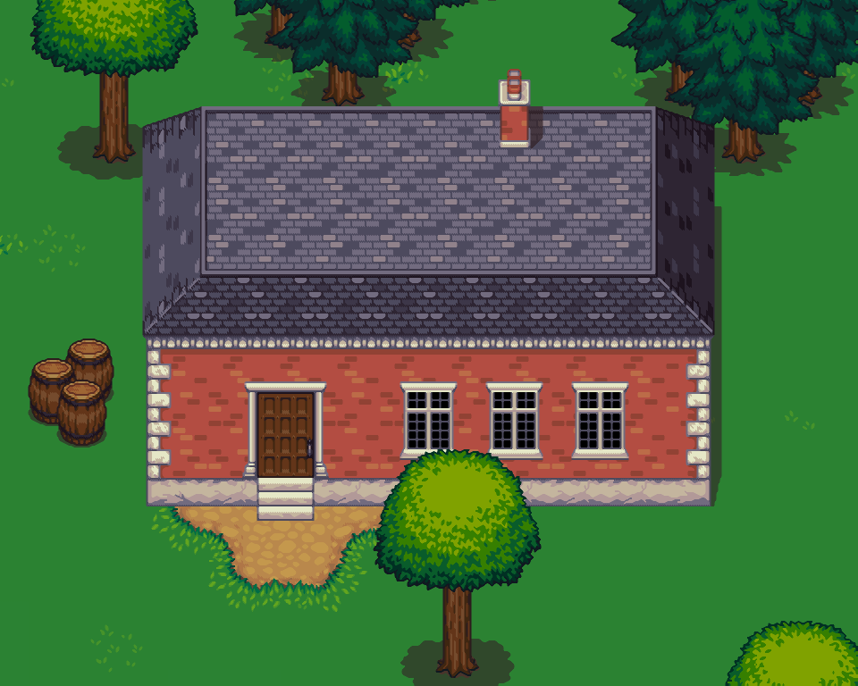

+++
title = "Pixel Art Scaling Comparison — Part 1"
date = "2014-04-11"
tags = ["Pixel Art"]
+++

I've been playing with a few scaling algorithms in the [2dimagefilter](https://code.google.com/p/2dimagefilter/) project. They produce impressive results when fed pixel art, and the fact that emulators can run them in real-time is just mind-boggling.
{.lead}

<!--more-->

Here I've chosen a bunch of images to showcase the Eagle, SuperEagle, SaI, and SuperSaI algorithms. [Part 2]() continues with the EPX/Scale, HQx, xBR, and xBRZ algorithms.

## Eagle

Eagle is the grandfather of pixel art scaling algorithms. It's a bit long in the tooth these days, but has served as inspiration to many.

Here you can see an image scaled using Eagle, compared to your standard nearest-neighbor algorithm:


  <canvas id="eaglec-target">
    
    
  </canvas>



import ImageCompare from "compare.mjs";

new ImageCompare(document.getElementById("eaglec-target"), {
  path1: document.getElementById("eaglec-target-img1").src,
  path2: document.getElementById("eaglec-target-img2").src,
});


And here you can see the details:


  <canvas id="eaglez-target">
    
  </canvas>



import ImageZoom from "zoom.mjs";

new ImageZoom(document.getElementById("eaglez-target"), {
  path: document.getElementById("eaglez-target-img").src,
});


It produces some weird artifacts in areas like the roof and the barrels, but it does a decent job overall.

## SuperEagle

SuperEagle was developed by Kreed in 1999, as an enhancement of the original Eagle algorithm.

Here you can see an image scaled using SuperEagle, compared to nearest-neighbor:


  <canvas id="seaglec-target">
    
    
  </canvas>



import ImageCompare from "compare.mjs";

new ImageCompare(document.getElementById("seaglec-target"), {
  path1: document.getElementById("seaglec-target-img1").src,
  path2: document.getElementById("seaglec-target-img2").src,
});


And here you can see the details:


  <canvas id="seaglez-target">
    
  </canvas>



import ImageZoom from "zoom.mjs";

new ImageZoom(document.getElementById("seaglez-target"), {
  path: document.getElementById("seaglez-target-img").src,
});


It manages to alleviate the artifacts seen with Eagle by doing more blending, but doesn't solve them completely.

## SaI

The SaI algorithm was developed by Kreed in 1999, following a similar approach as the one used in Eagle.

Here you can see an image scaled using SaI, compared to nearest-neighbor:


  <canvas id="saic-target">
    
    
  </canvas>



import ImageCompare from "compare.mjs";

new ImageCompare(document.getElementById("saic-target"), {
  path1: document.getElementById("saic-target-img1").src,
  path2: document.getElementById("saic-target-img2").src,
});


And here you can see the details:


  <canvas id="saiz-target">
    
  </canvas>



import ImageZoom from "zoom.mjs";

new ImageZoom(document.getElementById("saiz-target"), {
  path: document.getElementById("saiz-target-img").src,
});


It does a really good job with this image. I can see why it's still popular after all these years.

## SuperSaI

SuperSaI, also written by Kreed in 1999, is a combination of the Eagle and SaI algorithms.

Here you can see an image scaled using SuperSaI, compared to nearest-neighbor:


  <canvas id="ssaic-target">
    
    
  </canvas>



import ImageCompare from "compare.mjs";

new ImageCompare(document.getElementById("ssaic-target"), {
  path1: document.getElementById("ssaic-target-img1").src,
  path2: document.getElementById("ssaic-target-img2").src,
});


And here you can see the details:


  <canvas id="ssaiz-target">
    
  </canvas>



import ImageZoom from "zoom.mjs";

new ImageZoom(document.getElementById("ssaiz-target"), {
  path: document.getElementById("ssaiz-target-img").src,
});


The additional blending doesn't do much good in this particular case, but I'm sure there are scenarios where it makes a lot of sense.

---

Continue to [Part 2]() if you want to check out the EPX/Scale, HQx, xBR, and xBRZ algorithms.
