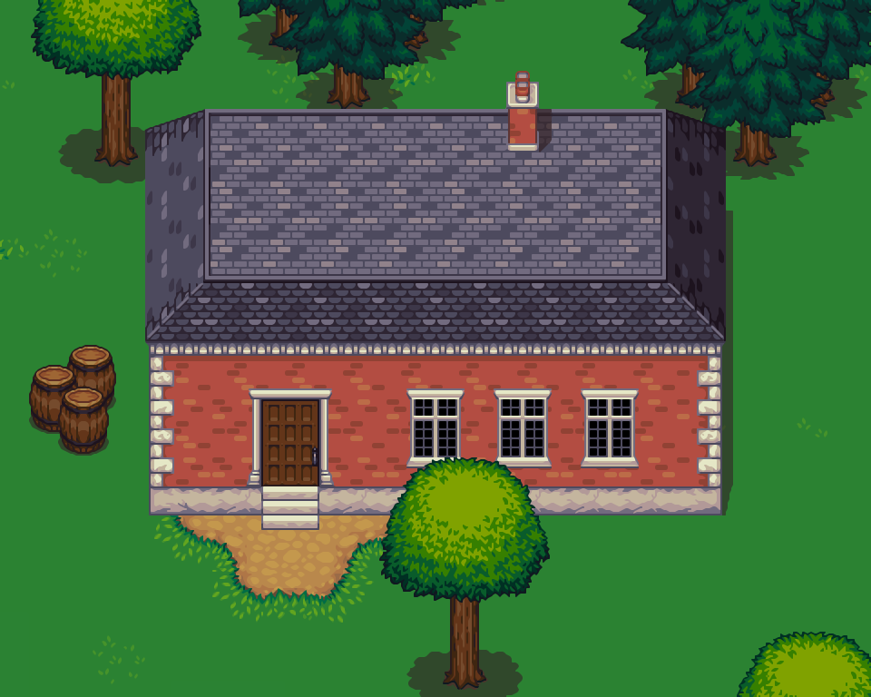

+++
title = "Pixel Art Scaling Comparison — Part 2"
date = "2014-04-18"
tags = ["Pixel Art"]
+++

I've been playing with a few other scaling algorithms in the [2dimagefilter](https://code.google.com/p/2dimagefilter/) project. They produce even more impressive results than the previous batch.
{.lead}

<!--more-->

[Part 1]() showcased the Eagle, SuperEagle, SaI, and SuperSaI algorithms. I'm continuing here with EPX/Scale, HQx, xBR, and xBRZ.

## EPX/Scale

The EPX algorithm was originally developed by Eric Johnston at LucasArts around 1992.

Nine years later, while working on the AdvanceMAME project, Andrea Mazzoleni developed the Scale algorithm, which produced exactly the same results as EPX, even though Andrea didn't know of its existence. Great minds think alike, I guess.

Here you can see an image scaled using Scale, compared to the nearest-neighbor algorithm:


  <canvas id="scalec-target">
    
    
  </canvas>



import ImageCompare from "compare.mjs";

new ImageCompare(document.getElementById("scalec-target"), {
  path1: document.getElementById("scalec-target-img1").src,
  path2: document.getElementById("scalec-target-img2").src,
});


And here you can see the details:


  <canvas id="scalez-target">
    
  </canvas>



import ImageZoom from "zoom.mjs";

new ImageZoom(document.getElementById("scalez-target"), {
  path: document.getElementById("scalez-target-img").src,
});


Great results. I can see why so many emulators include it.

## HQx

The HQx family of algorithms (HQ2x, HQ3x, HQ4x) was created by Maxim Stepin around 2003. They are all based on pattern recognition using a pregenerated lookup table.

Here you can see an image scaled using HQx, compared to nearest-neighbor:


  <canvas id="hqxc-target">
    
    
  </canvas>



import ImageCompare from "compare.mjs";

new ImageCompare(document.getElementById("hqxc-target"), {
  path1: document.getElementById("hqxc-target-img1").src,
  path2: document.getElementById("hqxc-target-img2").src,
});


And here you can see the details:


  <canvas id="hqxz-target">
    
  </canvas>



import ImageZoom from "zoom.mjs";

new ImageZoom(document.getElementById("hqxz-target"), {
  path: document.getElementById("hqxz-target-img").src,
});


Excluding the blurriness of the roof pattern, it does a great job with this image.

## xBR

The xBR algorithm was created by Hyllian in 2011. It is also based on pattern recognition, but uses a multi-stage set of interpolation rules.

Here you can see an image scaled using xBR, compared to nearest-neighbor:


  <canvas id="xbrc-target">
    
    
  </canvas>



import ImageCompare from "compare.mjs";

new ImageCompare(document.getElementById("xbrc-target"), {
  path1: document.getElementById("xbrc-target-img1").src,
  path2: document.getElementById("xbrc-target-img2").src,
});


And here you can see the details:


  <canvas id="xbrz-target">
    
  </canvas>



import ImageZoom from "zoom.mjs";

new ImageZoom(document.getElementById("xbrz-target"), {
  path: document.getElementById("xbrz-target-img").src,
});


The results are much sharper than what HQx produced for this image. Extremely impressive.

## xBRZ

The xBRZ algorithm was created by Zenju in 2012, as an enhanced and optimized version of xBR. It equals the performance of HQx, and on certain architectures it even surpasses it.

Here you can see an image scaled using xBRZ, compared to nearest-neighbor:


  <canvas id="xbrzc-target">
    
    
  </canvas>



import ImageCompare from "compare.mjs";

new ImageCompare(document.getElementById("xbrzc-target"), {
  path1: document.getElementById("xbrzc-target-img1").src,
  path2: document.getElementById("xbrzc-target-img2").src,
});


And here you can see the details:


  <canvas id="xbrzz-target">
    
  </canvas>



import ImageZoom from "zoom.mjs";

new ImageZoom(document.getElementById("xbrzz-target"), {
  path: document.getElementById("xbrzz-target-img").src,
});


I can't tell it apart from xBR. Everything looks super sharp.

---

That's all for now, I guess. If you enjoyed this, be sure to check out the paper [Depixelizing Pixel Art](https://johanneskopf.de/publications/pixelart/) by Johannes Kopf and Dani Lischinski. The supplementary material also contains a ton of interesting comparisons between algorithms.
