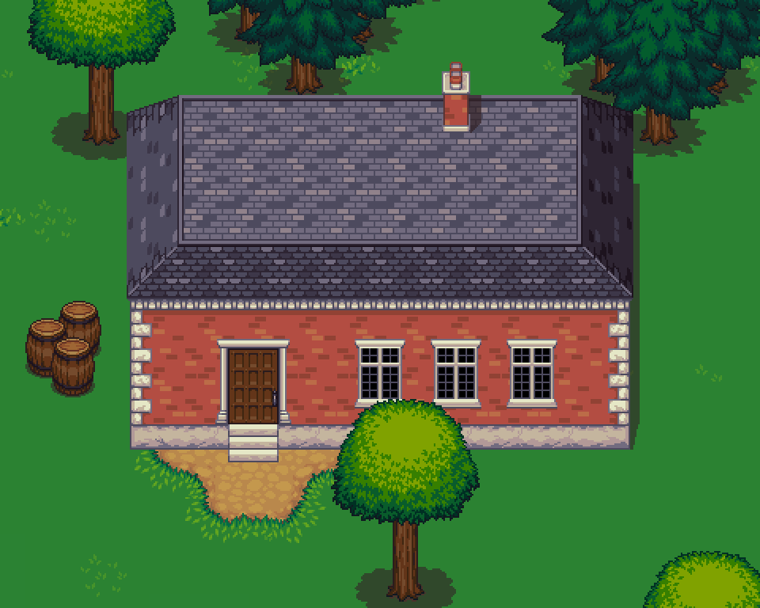
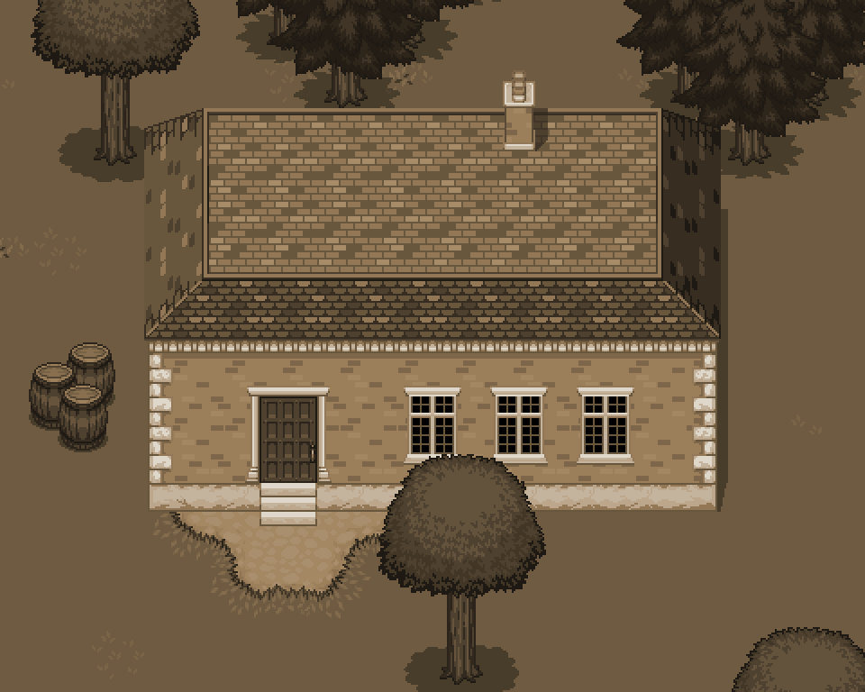

+++
title = "Compare Two Images Side-by-Side"
date = "2014-04-09"
tags = ["Canvas", "Pixel Art"]
+++

Small widget to compare two images side by side, for my articles on pixel art scaling (parts [one]() and [two]()).
{.lead}

<!--more-->


  <canvas id="compare-target">
    
    
  </canvas>



import ImageCompare from "./compare.mjs";

new ImageCompare(document.getElementById("compare-target"), {
  path1: document.getElementById("compare-target-img1").src,
  path2: document.getElementById("compare-target-img2").src,
  editable: true,
});


The [TwentyTwenty](https://zurb.com/playground/twentytwenty) jQuery plugin does this beautifully, but I wanted to avoid external dependencies.

The whole thing turned out to be relatively straightforward, using [`drawImage`](https://developer.mozilla.org/docs/Web/API/CanvasRenderingContext2D/drawImage).
