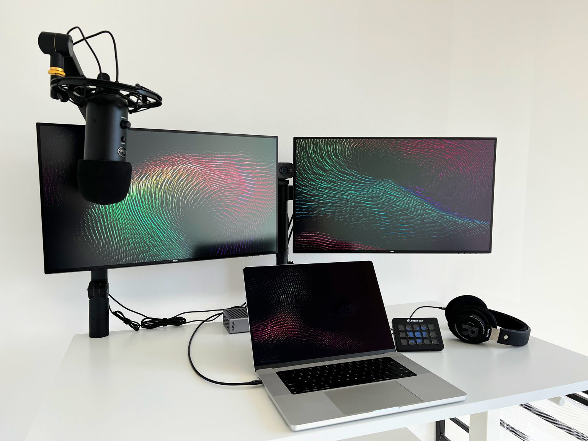
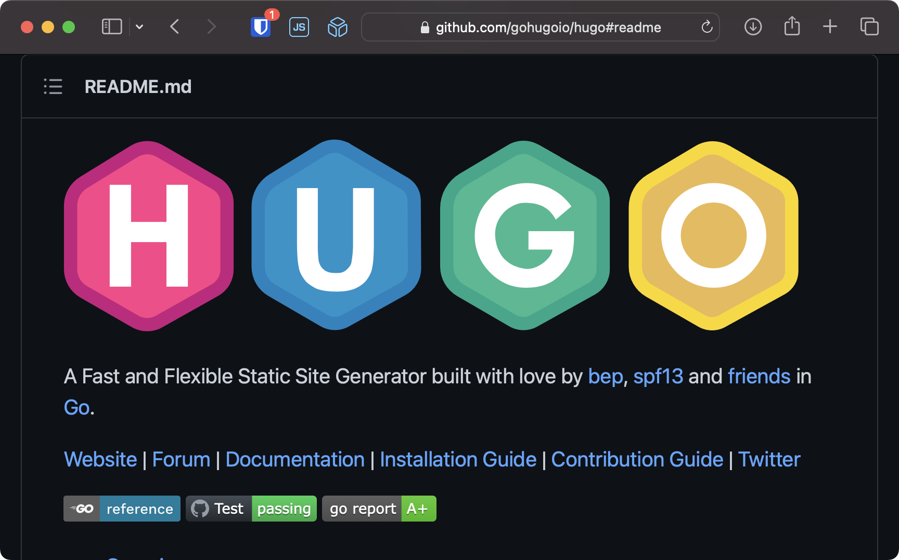
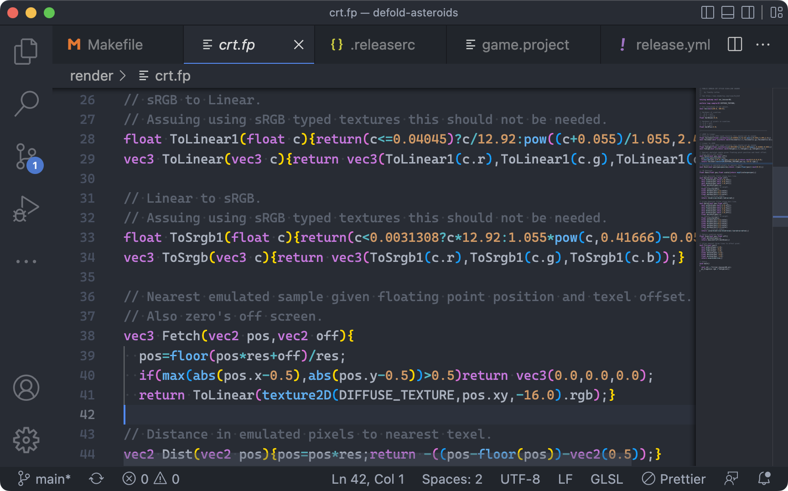
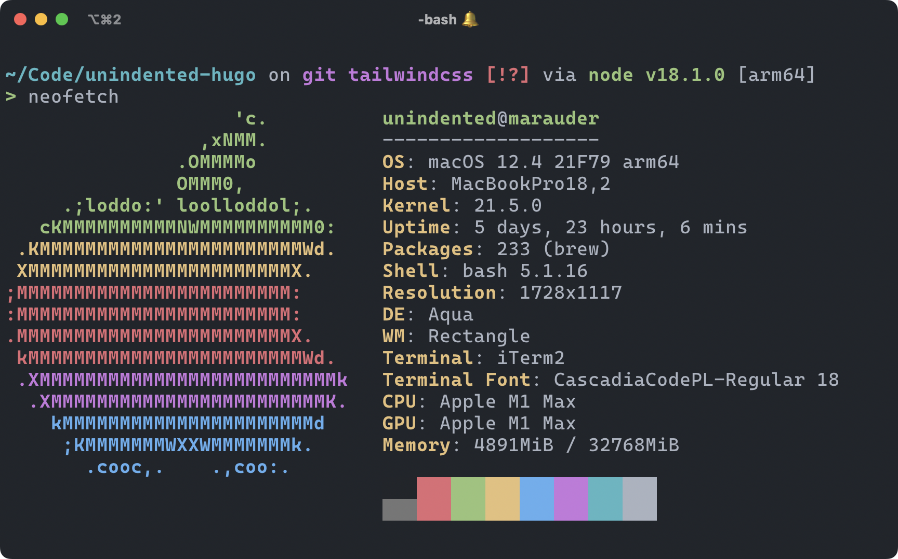
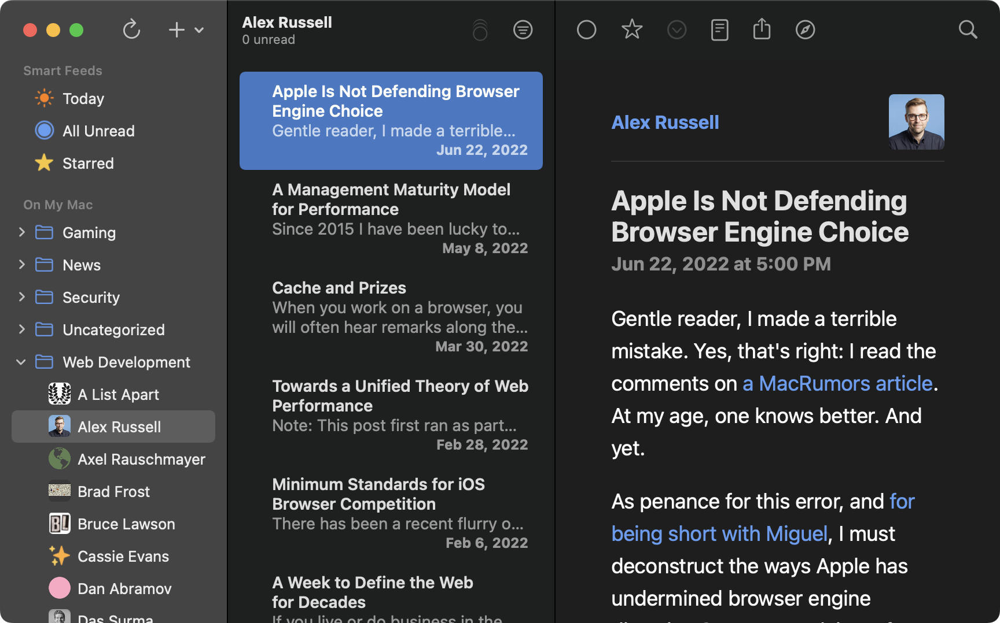
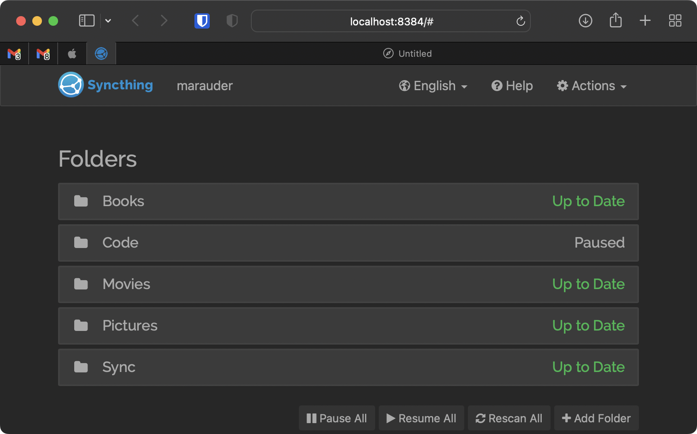

+++
title = "Stuff I Use"
+++

## Hardware

Computer --- [MacBook Pro 16" (M1 Max, 2021)](https://amzn.unindented.org/B09JQRGJF3)
: Superb performance. Crazy expensive though.

Monitors --- [Dell UltraSharp U2720Q 27"](https://amzn.unindented.org/B086H26XWV) (2x)
: Great image quality for the price. My only gripe is that they're USB-C, not Thunderbolt, so I can't daisy-chain them.

Monitor arm --- [VIVO Dual Mount](https://amzn.unindented.org/B009S750LA)
: I don't really move my monitors, so this cheap arm works perfectly fine for me.

Webcam --- [Logitech StreamCam](https://amzn.unindented.org/B07TZT4Q89)
: Decent image quality. A little on the pricier side.

Microphone --- [Blue Yeti](https://amzn.unindented.org/B00N1YPXW2)
: It produces good sound, but it also picks up a lot of noise, even with the gain knob all the way down. I have to rely on [Blue VO!CE](https://www.bluemic.com/en-us/products/blue-voice/) for noise reduction.

Headphones --- [Philips SHP9500](https://amzn.unindented.org/B00ENMK1DW)
: They're accurate enough for my untrained ears. Very comfortable too.

Macro keypad --- [Elgato Stream Deck MK.2](https://amzn.unindented.org/B09738CV2G)
: 15 programmable keys to play with. I mostly use it to switch input and output devices, and automate tasks (like responding to email).

Docking station --- [CalDigit TS4](https://amzn.unindented.org/B09GK8LBWS)
: I've tried a bunch of docking stations, and this is the one that works best with my devices. It has a bit of coil whine, but I don't care enough to return it.

Desk --- [IKEA TROTTEN](https://www.ikea.com/us/en/p/trotten-40507342/)
: Simple design. I'm always standing, so I'm not bothered by the crank.


Some of those are affiliate links, which give me a small kickback at no cost to you.


## Software

Browser --- [Safari](https://www.apple.com/safari/)
: It's the lesser evil. I've tried [Ungoogled Chromium](https://github.com/Eloston/ungoogled-chromium), and it works great, but I can't put that much trust in some random repo. I still use [Chrome](https://www.google.com/chrome/) and [Firefox](https://www.mozilla.org/firefox/) for development, because their tooling is way better than Safari's.

Browser extensions --- [Bitwarden](https://bitwarden.com/), [1Blocker](https://1blocker.com/) / [uBlock Origin](https://github.com/gorhill/uBlock)
: That's all. I try to keep browser extensions to a minimum, to reduce attack surface.

Editor --- [Visual Studio Code](https://code.visualstudio.com/)
: I still do some stuff with [Vim](https://www.vim.org/) / [Neovim](https://neovim.io/), but they require too much tweaking for my taste.

Editor theme --- [One Dark](https://marketplace.visualstudio.com/items?itemName=mskelton.one-dark-theme)
: Based on [Atom's One Dark theme](https://github.com/atom/one-dark-syntax).

Editor font --- [Cascadia Code](https://github.com/microsoft/cascadia-code)
: I'm a fan of [Inconsolata-dz](https://nodnod.net/posts/inconsolata-dz/), but Cascadia Code has been growing on me.

Editor extensions --- [ESLint](https://marketplace.visualstudio.com/items?itemName=dbaeumer.vscode-eslint), [Hex Editor](https://marketplace.visualstudio.com/items?itemName=ms-vscode.hexeditor), [Prettier](https://marketplace.visualstudio.com/items?itemName=esbenp.prettier-vscode), [Rewrap](https://marketplace.visualstudio.com/items?itemName=stkb.rewrap), [rust-analyzer](https://marketplace.visualstudio.com/items?itemName=matklad.rust-analyzer)
: I also try to keep editor extensions to a minimum.

Terminal --- [iTerm2](https://iterm2.com/)
: The built-in Terminal app has been improving a lot, but I can't live without little things like clicking paths to open them. [Alacritty](https://alacritty.org/) and [kitty](https://sw.kovidgoyal.net/kitty/) fall in the same boat.

Terminal theme --- [One Dark](https://github.com/one-dark/iterm-one-dark-theme)
: Same as the editor.

Terminal font --- [Cascadia Code](https://github.com/microsoft/cascadia-code)
: Same as the editor.

Shell --- [bash](https://www.gnu.org/software/bash/)
: Most machines I `ssh` into have bash as their default shell, and I don't want to think about all the little inconsistencies between it and [zsh](https://www.zsh.org/). I haven't tried [fish](https://fishshell.com/) yet.

Prompt --- [Starship](https://starship.rs/)
: It works on all the shells and all the operating systems I care about, so I can get a consistent experience just by copying a TOML config file.

RSS reader --- [NetNewsWire](https://netnewswire.com/)
: Such a great app.

Design tool --- [Figma](https://www.figma.com/)
: I had used [Sketch](https://www.sketch.com/) a bunch in the past, but Figma takes everything to the next level.

Image editor --- [Krita](https://krita.org/)
: It's mostly focused towards illustrators, but it's great at general image editing too.

Audio editor --- [Audacity](https://www.audacityteam.org/)
: Yeah, the UI looks outdated, but it does a great job.

Video editor --- [DaVinci Resolve](https://www.blackmagicdesign.com/products/davinciresolve/)
: The free version is pretty freaking capable. It's got quite the learning curve though.

Password manager --- [Bitwarden](https://bitwarden.com/)
: When [1Password](https://1password.com/) went subscription-only, I looked around and found Bitwarden. I haven't looked back.

VPN client --- [WireGuard](https://apps.apple.com/us/app/wireguard/id1451685025?mt=12)
: Easy to set up, fast, and reliable.

Window manager --- [Rectangle](https://rectangleapp.com/)
: I've also tried [Amethyst](https://ianyh.com/amethyst/), a tiling window manager along the lines of [xmonad](https://xmonad.org/), but it doesn't fit my workflow.

## Services

File sync --- [Syncthing](https://syncthing.net/)
: I got fed up with [Dropbox](https://www.dropbox.com/), and ended up switching to Syncthing. No regrets.

File backup --- [Hyper Backup](https://www.synology.com/dsm/feature/hyper_backup)
: I use Azure cool storage as destination.

Code hosting --- [GitHub](https://github.com/)
: Who woulda thunk it.

Web hosting --- [DreamHost](https://www.dreamhost.com/r.cgi?300375)
: It gives me everything I need. Support has always been excellent.

Search engine --- [DuckDuckGo](https://duckduckgo.com/)
: I'm trying to reduce the amount of personal information I give away. I still rely on `!g` quite a bit though.

VPN server --- [Algo](https://github.com/trailofbits/algo)
: I don't trust any VPN providers, so I self-host Algo on Azure. It works great with the official WireGuard clients on all my devices.

<!--more-->
